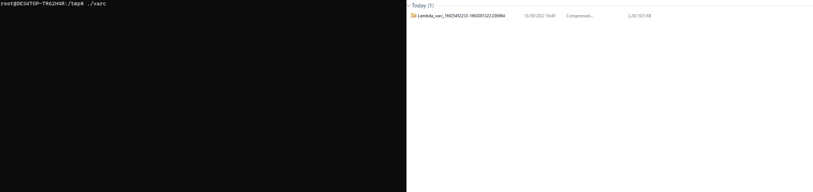

# varc (Volatile Artifact Collector) #

[](https://badge.fury.io/py/varc)

varc collects a snapshot of volatile data from a system.
It tells you what is happening on a system, and is of particular use when investigating a security incident.

It creates a zip, which contains a number of different pieces of data to understand what is happening on a system:
- JSON files e.g. running processes and what network connections they are making
- Memory of running proccesses, on a per-process basis. This is also carved to extract log and text data from memory
- Netstat data of active connections
- The contents of open files, for example running binaries
- Details of which processes triggered a provided compiled YARA rule file

We have successfully executed it across:
- Windows
- Linux
- OSX
- Cloud environments such as AWS EC2
- Containerised Docker/Kubernetes environments such as AWS ECS/EKS/Fargate and Azure AKS
- Even serverless environments such as AWS Lambda

Check out the example captures under the "Releases" tab to see some crazy data!
The screen recording below shows a collection from a Docker container (left) and the output from running inside and AWS Lambda function which deployed Xmrig (right):



In line with the order of volatility, we collect process memory before anything else. Note that varc, and any other tool that runs inside a system, will impact the memory of a system.

### Using as a compiled binary ###
You can find compiled binaries for Windows, Linux and OSX under the Releases tab.
Simply execute and a zip is created with the output.
To access some data, you will need to run with elevated privileges (i.e. sudo or root on Linux).
```
usage: varc [-h] [--skip-memory] [--skip-open] [--dump-extract] ...

optional arguments:
  -h, --help      show this help message and exit
  --skip-memory   Skip collecting process memory, which can be slow
  --skip-open     Skip collecting open files, which can be slow
  --dump-extract  Extract process memory dumps, which can be slow
```

### Using as a Python library ###

Install from pip with:
```
pip3 install varc
```

Or alternatively, clone this repository then install with:
```
python3 setup.py install
```

Then call with: 
```
from varc import acquire_system
output_file_path = acquire_system().zip_path
```

### Automated Investigations and Response ###
varc significantly simplifies the acquisition and analysis of volatile data.
Whilst it can be used manually on an ad-hoc basis, it is a great match for automatic deployment in response to security detections.
The output of varc is designed to be easily consumed by other tools, in standard JSON format as much as possible.

A typical pipeline might be:
* A detection is fired from a detection tool
* varc is deployed to collect and identify further activity
* Further remediation actions are taken based on the analysis of varc output

 ### Why are the collected memory files empty? ###
Process memory collection is not currently supported on OSX.

If you run varc on a Linux system without the Ptrace Kernel capability enabled, you will get empty memory files.
You will still get detailed system output.

For example, in our testing:
* AWS Lambda successfully dumped process memory by default.
* EKS on EC2 successfully dumped process memory by default.
* ECS on Fargate required us to enable [CAP_SYS_PTRACE](https://docs.aws.amazon.com/AWSCloudFormation/latest/UserGuide/aws-properties-ecs-taskdefinition-kernelcapabilities.html) in our task definition.


### Using the collected data ###
All data is saved in an open, non-propietary format in the hope it can easily be processed by other community tools.

Our free tool [Cado Community Edition](https://www.cadosecurity.com/cado-community-edition/) will happily parse this zip, and display the JSON data tables as intended.

Our commercial tool [Cado Response](https://www.cadosecurity.com/platform/) additionally enables you to automatically capture both static and volatile data from systems through Cado Host. By using the API, you can automatically investigate and respond to to detections from third party tools such as an EDR like SentinelOne or a cloud detection tool like GuardDuty.

Here is an example of varc output for a Lambda function running xmrig, viewed in [Cado Community Edition](https://www.cadosecurity.com/cado-community-edition/):


### License ###
This is licensed under the GPL. Please contact us if this does not work for your use case - we may be able to alternatively license under a non-copyleft license such as the Apache License. We're friendly!
As this software is licensed under the GPL and used in our commercial product, we ask any contributors to sign a simple Contributor License Agreement (CLA). 

### License ###
We would love any Pull Requests or Bug Reports!


